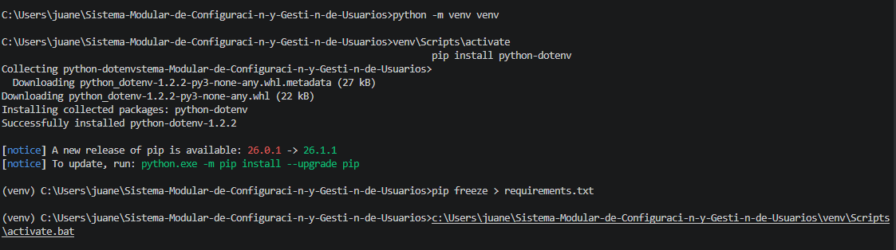
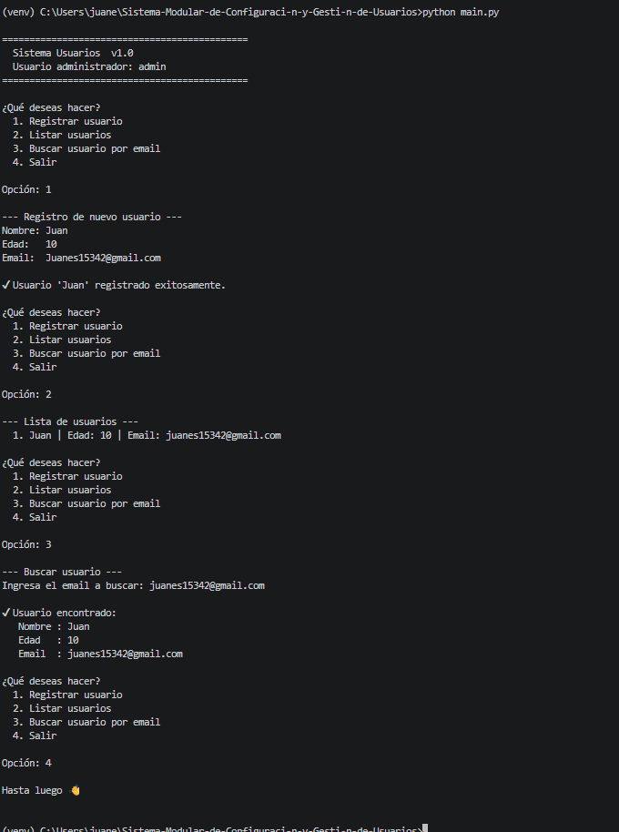

# 🧩 Sistema Modular de Configuración y Gestión de Usuarios

Aplicación de consola desarrollada en **Python** que permite gestionar usuarios de forma modular, aplicando buenas prácticas de organización de proyectos, entornos virtuales, variables de entorno y manejo de excepciones.

---

## 📋 Requisitos previos

- Python 3.10 o superior
- Git
- Visual Studio Code (recomendado)
- Terminal de comandos (CMD, PowerShell, Bash)

---

## 📁 Estructura del proyecto

```
sistema_usuarios/
├── app/
│   ├── __init__.py               # Inicializa el paquete app
│   └── usuarios/
│       ├── __init__.py           # Expone funciones del gestor
│       ├── gestor.py             # Lógica: registrar, listar, buscar
│       └── validaciones.py       # Validaciones de nombre, edad y email
├── config/
│   ├── __init__.py               # Inicializa el paquete config
│   └── settings.py               # Carga variables de entorno con dotenv
├── venv/                         # Entorno virtual (no se sube a GitHub)
├── .env                          # Variables de entorno locales (no se sube)
├── .env.example                  # Plantilla pública del archivo .env
├── main.py                       # Punto de entrada — menú principal
├── requirements.txt              # Dependencias del proyecto
└── README.md                     # Documentación del proyecto
```

---

## ⚙️ Configuración del entorno

### 1. Clonar el repositorio

```bash
git clone https://github.com/tu-usuario/sistema-usuarios.git
cd sistema-usuarios
```

### 2. Crear el entorno virtual

**Con venv (incluido en Python):**
```bash
python -m venv venv
```

**Con virtualenv:**
```bash
pip install virtualenv
virtualenv venv
```

### 3. Activar el entorno virtual

| Sistema operativo | Comando |
|---|---|
| Windows (CMD) | `venv\Scripts\activate` |
| Windows (PowerShell) | `venv\Scripts\Activate.ps1` |
| macOS / Linux | `source venv/bin/activate` |

Una vez activo, verás el prefijo `(venv)` en tu terminal.

### 4. Instalar dependencias

```bash
pip install -r requirements.txt
```

**Con uv (alternativa moderna):**
```bash
pip install uv
uv pip install -r requirements.txt
```



---


## 🔐 Variables de entorno

El proyecto usa **python-dotenv** para cargar configuración sensible desde un archivo `.env`.

### Crear el archivo `.env`

Copia el archivo de ejemplo y edítalo con tus valores:

```bash
cp .env.example .env
```

### Contenido del `.env`

```env
APP_NAME=Sistema Usuarios
APP_VERSION=1.0
ADMIN_USER=admin
```

| Variable | Descripción | Valor por defecto |
|---|---|---|
| `APP_NAME` | Nombre de la aplicación | `Sistema Usuarios` |
| `APP_VERSION` | Versión actual | `1.0` |
| `ADMIN_USER` | Usuario administrador del sistema | `admin` |

> ⚠️ **Importante:** El archivo `.env` **nunca** debe subirse a GitHub. Está incluido en `.gitignore`. Usa `.env.example` como referencia pública.

---

## ▶️ Ejecutar el proyecto

Con el entorno virtual activo, desde la carpeta raíz del proyecto:

```bash
python main.py
```

Verás el menú principal:

```
=============================================
  Sistema Usuarios  v1.0
  Usuario administrador: admin
=============================================

¿Qué deseas hacer?
  1. Registrar usuario
  2. Listar usuarios
  3. Buscar usuario por email
  4. Salir
```



---

## 🧪 Funcionalidades del sistema

| Opción | Descripción |
|---|---|
| **1. Registrar usuario** | Solicita nombre, edad y email. Valida cada campo antes de guardar. |
| **2. Listar usuarios** | Muestra todos los usuarios registrados en la sesión. |
| **3. Buscar usuario** | Busca por email y muestra los datos del usuario si existe. |
| **4. Salir** | Termina la ejecución del programa. |

### Validaciones implementadas

- **Nombre:** no puede estar vacío ni contener números.
- **Edad:** debe ser un entero entre 0 y 120.
- **Email:** debe contener `@` y un dominio válido.
- **Duplicados:** no se permite registrar dos usuarios con el mismo email.

---

## 🧩 Explicación de módulos y paquetes

### `config/settings.py`
Responsable exclusivamente de **cargar las variables de entorno**. Utiliza `python-dotenv` para leer el archivo `.env` y expone las variables como constantes importables en cualquier parte del proyecto.

```python
from config.settings import APP_NAME, APP_VERSION, ADMIN_USER
```

### `app/usuarios/validaciones.py`
Contiene funciones puras de **validación de datos**. Cada función lanza una excepción `ValueError` con un mensaje descriptivo si el dato no es válido. Separar las validaciones en su propio módulo permite reutilizarlas y testearlas de forma independiente.

```python
validar_nombre(nombre)   # No vacío, sin números
validar_edad(edad)       # Entero, entre 0 y 120
validar_email(email)     # Formato básico con @ y dominio
```

### `app/usuarios/gestor.py`
Contiene la **lógica de negocio**: registrar, listar y buscar usuarios. Utiliza las validaciones antes de persistir cualquier dato. Los usuarios se almacenan en memoria como lista de diccionarios.

```python
registrar_usuario(nombre, edad, email)  # Valida y guarda
listar_usuarios()                        # Retorna todos
buscar_usuario(email)                    # Busca por email
```

### `app/usuarios/__init__.py`
Expone las funciones del gestor directamente desde el paquete `app.usuarios`, simplificando las importaciones en `main.py`.

### `main.py`
Punto de entrada de la aplicación. Muestra el menú interactivo, captura la entrada del usuario y delega cada acción al módulo correspondiente. Maneja excepciones para mostrar mensajes amigables sin romper la ejecución.

---

## 📦 Dependencias

```
python-dotenv==1.2.2
```

Generado con:
```bash
pip freeze > requirements.txt
```

---

## 🗂️ Archivo `.env.example`

```env
# Copia este archivo como .env y completa los valores
APP_NAME=Sistema Usuarios
APP_VERSION=1.0
ADMIN_USER=admin
```

---

## 🚀 Subir a GitHub

```bash
git init
git add .
git commit -m "feat: sistema modular de gestión de usuarios"
git branch -M main
git remote add origin https://github.com/tu-usuario/sistema-usuarios.git
git push -u origin main
```

Asegúrate de tener un `.gitignore` con al menos:

```
venv/
.env
__pycache__/
*.pyc
```

---


## 👤 Autor

- **Nombre:** Juan Esteban Henao Echav
- **Programa:** Análisis y Desarrollo de Software — SENA
- **Fecha:** 2025